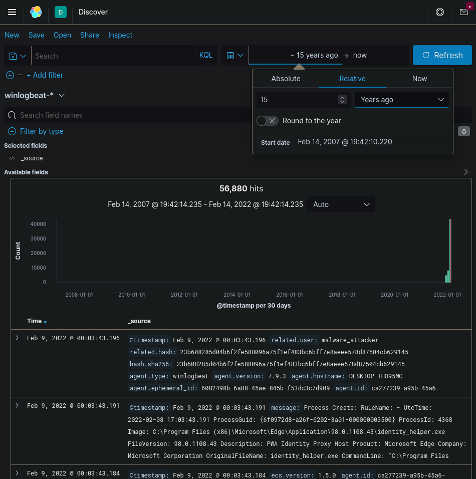
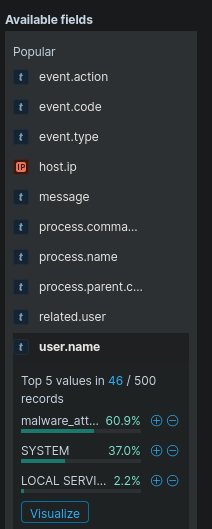

# cant-touch-this

```
author: Voif
score: 300
solved: 11/70
difficulty: medium
type: misc
```

## Problem

The Nesteaz company suffered from a security breach. We are low on personnel and we require your help in investigating the events collected from the compromised machine.

> Credentials: elastic/k8jTYMCoAqppB
> Address: 34.141.93.151:32729

## Got the flag

Given a Kibana dashboard (popular in IT world, esp in software operation/sysadmin/devops.
ELK is a stack comprises of Elasticsearch + LogStash + Kibana, the most popular
solution for centralized log management).

Menu top left > Kibana > Discover. In the "Search", no need to type anything
but in the box to choose date, chose some long duration like 15 years ago then
search.



The logs are sent from `winlogbeat` (agent.type), the agent that ships logs from Windows to ELK stack. Have never used Windows for profesional work, these logs are alien at the first look.


6 flags:

> Please provide the user account on which malicious actions were executed. (Points: 50)

Click on the first message the `>` icon, it expands then show many fields, see `user.name`: `malware_attacker`, enter that in, then got first flag. Kibana allow to show Top 5 values in X/Y records, so click on that also show all popular values for `user.name`.



> We need the IP of the compromised machine (Points: 50)

Same above message, look at `host.ip`, and found `fe80::2c01:7d2d:f272:221d, 192.168.0.108`, enter the IPv4 `192.168.0.108` and got then 2nd flag.

> The attacker managed to give full privileges to his account. We need the code of the event triggered by this action. (Points: 50)
This want `code of the event`, there is a field in message named `event.code`, try the oldest message by using the mouse to select on the timeline, choose small enough several times to got only <500 hits as Kibana shows only latest 500 messages.

The first message is when hacker logged into the server, has `event.code` `4672`, message:

```
Special privileges assigned to new logon.

Subject:
 Security ID:  S-1-5-18
 Account Name:  SYSTEM
 Account Domain:  NT AUTHORITY
 Logon ID:  0x3E7
```

I'm not very sure since not an Windows developer/admin (only gamer), but just try this got success next flag.

> The attackers managed to execute some malicious scripts without being detected by our security systems. Can you determine which program was executed? (Points: 50)

To navigate the message, we now can use user `malware_attacker` to filter out logs generated by this user. Just enter in search `malware_attacker`. From these look for `process.name` field. I don't remember what exactly the flag here but just trying some "weird" process name.

While not a Windows sysadmin, but used Windows as enduser, setup software and play game (with crack), I know that "svchost" is a normal program. So try Google all the name to see what could be a hacker program.

"Script" seems user needs to run from command lines, find programs `cmd` and `powershell`, go through messages, found [`defeat-defender`](https://github.com/swagkarna/Defeat-Defender-V1.2) (with the knowledge that Windows Defender is an antivirus by Windows on Windows). I didn't think of `script` part
but while try to find what commands attacker ran, found it.

> What system management tool did the attacker use in order to launch its program with full privileges? (Points: 50)

In many process names, there are `NSudo.exe` seems suspicous, tried it and
got flag.

> We know that the attacker managed to download an infected executable using a Windows utility. We need that name, please. (Points: 50)

In `process.name`, there are `msedge`, and `chrome`, which are browsers can be used to download (search for `download` keyword). But they are not the result. `bitsadmin` is the downloader after trying to google what `bitsadmin` process does https://gist.github.com/rosswd/cad64650ca1b03bd1789a69edbeb586c , it used to download `Winupdate.exe`, it's the flag.

## Conclusion
this tagged "medium" but pretty easy for a DevOps who daily use ELK
for searching logs. This could be harder if author

- created millions or billions log messages, make it impractical to go through one by one.
- set the timestamp to 1970 UNIX EPOCH, because the agent may mis-configured the
timestamp (send seconds) and ELK parsed (as millisec) that as since 1970.

But the easiness seems was intended. As the team solved this 11th, we got like 2000 scores
and jumped to top #25 at the time solved, nice mental boost!
