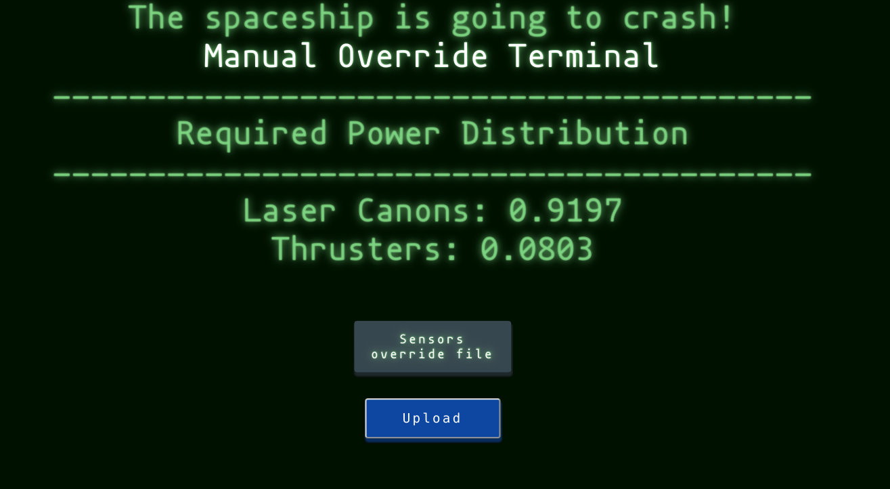
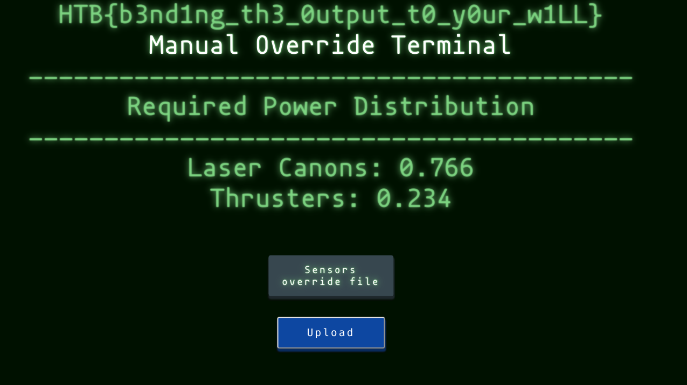

# Battle in OrI/On

```
score: 325
solved: 25
difficulty: medium
tags: misc, pytorch
```

Home page:



After inspect the code and the problem description, I have noticed something:

1. They just give us a pretrained model.
2. We need to generate a fake input that trick the model.
3. There are only 2 labels
4. There's 2 float numbers on the homepage that's sum to `1`.

It's clear what's we have to do now. (The numbers is the predicted probability of each label)

Here is the code:

https://gist.github.com/tudoanh/c1034d51fa9c9f530f8c83e8ba874ee1

I used MSE (mean-squared-error) as loss function.

Flag:


