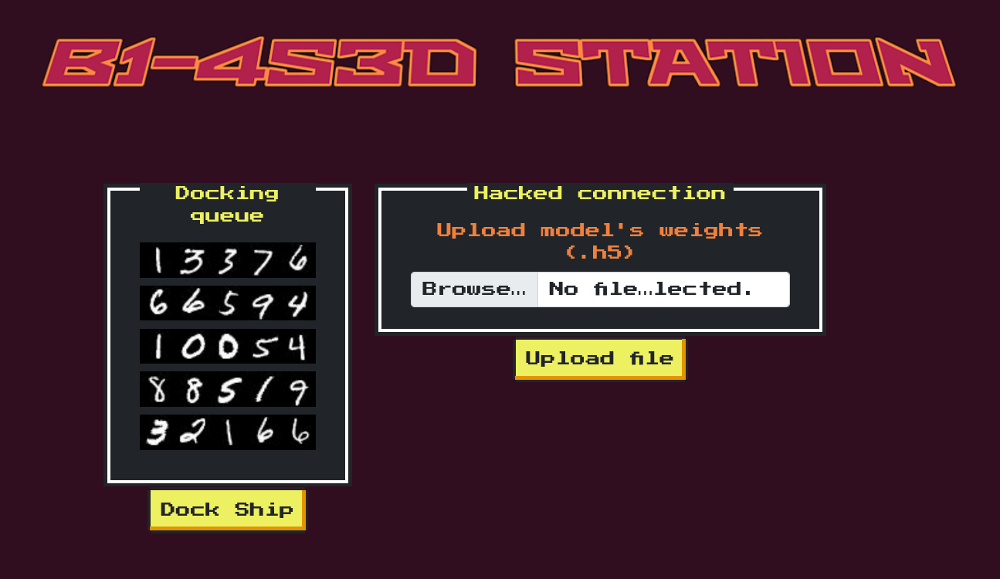

# Fuel Crisis

```
score: 325
solved: 70
difficulty: easy
tags: misc, keras, mnist
```

The homepage look like this:



After reading the code, I notice something:

1. The docking queue is generated randomly from MNIST dataset
2. We need to upload a new model as the second gate
3. The uploaded model must correctly predict every layer in queue except the last one
4. Only last layer ("Phalcon") has number `2`

```python
@app.route('/', methods=['GET', 'POST'])
def index():
    ...

    try:
        file.save(os.path.join(app.config['UPLOAD_FOLDER'], "uploaded.h5"))
        b1_4s3d_station.second_gate = tf.keras.models.load_model("./application/models/uploaded.h5")
    except:
        return render_template('index.html', ids = ids, response = "File upload failed.")

@app.route('/dock', methods=['POST'])
def dock():
    try:
        for spaceship in b1_4s3d_station.spaceships:
            id, id_confidence = b1_4s3d_station.passFirstGate(spaceship.id_image)
            if spaceship.name == "Phalcon":
                b1_4s3d_station.passSecondGate(id, spaceship.id_image, id_confidence, validation_check=False)
            else:
                b1_4s3d_station.passSecondGate(id, spaceship.id_image, id_confidence)
    except DockingException as de:
        return render_template('dock.html', response = spaceship.name+str(de))
    except Exception as e:
        return render_template('dock.html', response = 'Unexpected error while docking.')
    return render_template('dock.html', response = flag)

class Station():
    ...
    def passSecondGate(self, id,  id_image, id_confidence, validation_check = True):
        validated_id = ""
        for i in range(len(id_image)):
            num = id_image[i].reshape(1,28,28,1)
            pred = self.second_gate.predict(num)
            if validation_check:
                if round(pred[0][int(id[i])],1) == round(id_confidence[i],1):
                    pass
                else:
                    raise DockingException("'s ID was misclassified.")

            validated_id = validated_id + str(np.argmax(pred))

        if validated_id == self.bannedId:
            raise DockingException("'s ID is banned from the station.")
    ...
```

Thus we need to train a MNIST model, but update all training label `2` to other label, like `9`.

Here is the solution code, you can try it for free on Google Colab.

https://gist.github.com/tudoanh/2bf2fec35ce68285996fb846dbedf29c
