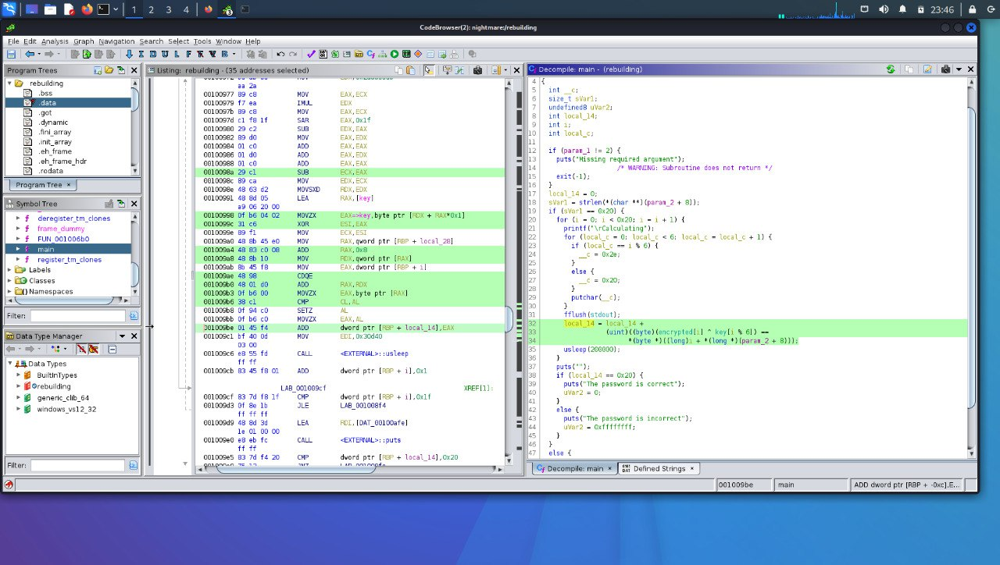

# Rebuilding

```
score: 300
solved: xx/xx
difficulty: easy
tags: re
```

## Problem
[file](./rebuilding)

## Got the flag
Decompile the binary in Ghidra, we see the code would xor the decrypted bytes
with user input value - len 6 chars.



encrypted is an array of 32 bytes, click on ghidra would ref to it and can
get those bytes.

Click on "key" would show value "humans".

But xor it with the obj.encrypted didn't give the flag. After stucking for awhile,
we try to run it with pwndbg, before xor, the value loaded is "aliens", not
"humans". Xor "aliens" with the encrypted, we got the flag.

```py
cs = [0x29 ,0x38 ,0x2b ,0x1e ,0x06 ,0x42 ,0x05 ,0x5d ,0x07 ,0x02 ,0x31 ,0x42 ,0x0f ,0x33 ,0x0a ,0x55 ,0x00 ,0x00 ,0x15 ,0x1e ,0x1c ,0x06 ,0x1a ,0x43 ,0x13 ,0x59 ,0x36 ,0x54 ,0x00 ,0x42 ,0x15 ,0x11 ]
secret = b"aliens"

from pwn import *
r= xor(cs, secret)
print(r)
```

b'HTB{h1d1ng_1n_c0nstruct0r5_1n1t}'
